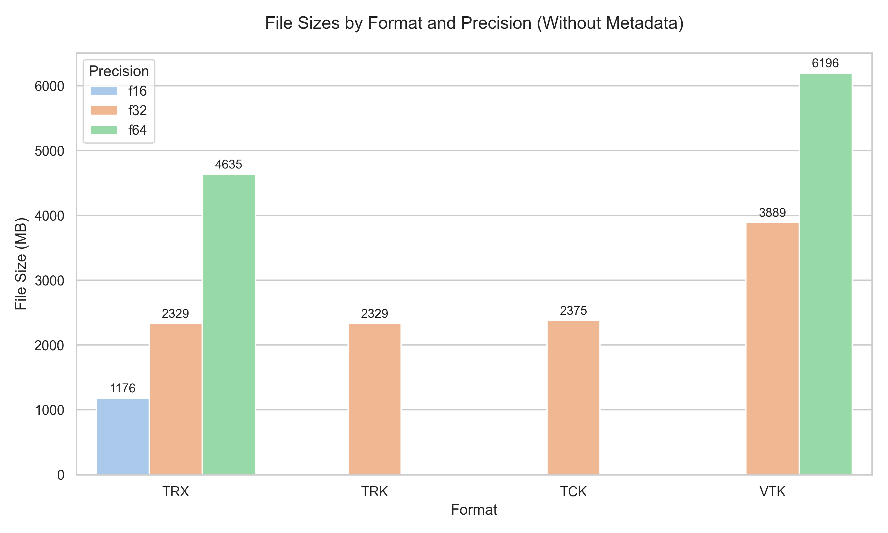
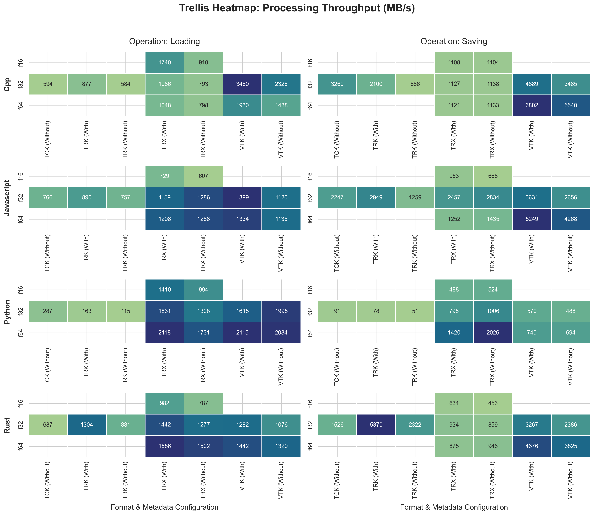
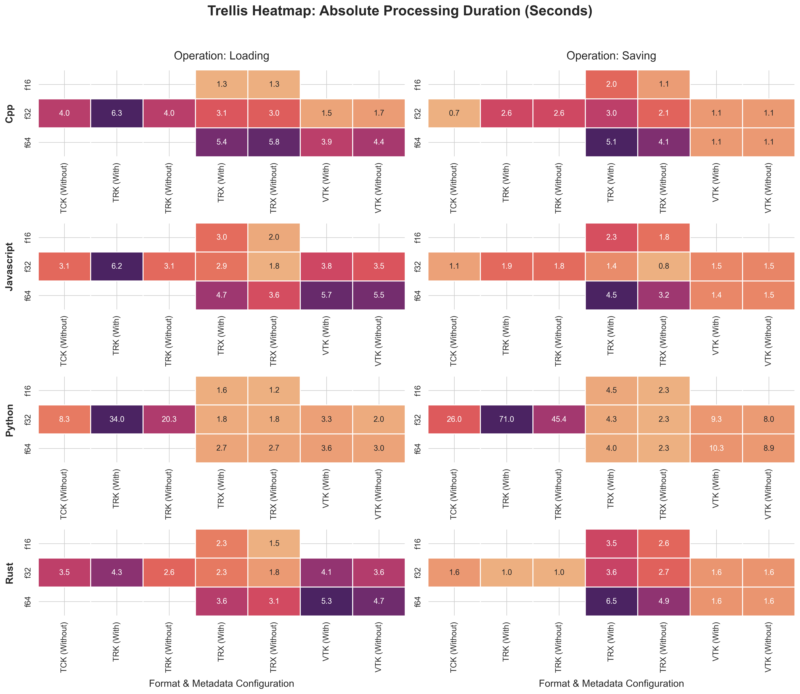

# Multi-Language Benchmarks and Interoperability

This page details the benchmark suite and relay testing designed to evaluate the I/O processing throughput of the Tractography eXchange (TRX) format compared to legacy formats (TRK, TCK, VTK) across four major programming languages: Python, Rust, C++, and JavaScript.

## Dataset and File Sizes

The benchmark rigorously measures disk-to-RAM I/O parsing duration and throughput across different configurations. Coordinate bit-precision (`f16`, `f32`, `f64`) and optional per-vertex or per-streamline metadata play a key role in file storage size.

TRX significantly reduces file size limits through efficient use of precision modes. Transitioning from `f16` to `f32` and `f64` scales coordinate storage linearly, but the base size remains much smaller compared to legacy formats storing equivalent data, especially when retaining metadata.

Below is a comparison of file sizes (in MB) without metadata, highlighting the compression advantage of TRX's `f16` format compared to legacy formats which typically operate in `f32` precision.

## Benchmark Results

To ensure parity between languages, legacy loaders, format translators, and spatial mapping functions were centralized directly into the core TRX libraries (`trx-python`, `trx-cpp`, `trx-javascript`, `trx-rs`). 

The performance results highlight both the processing duration and I/O throughput.

### I/O Throughput

**I/O Throughput trellis heatmap.**
This plot displays combined effective I/O throughput in megabytes per second (MB/s), computed as twice the file size divided by total load-plus-save duration. The proposed specification reaches competitive performance across all evaluated languages. The results demonstrate that architectural enhancements—such as control over data types, reduced storage requirements, and new feature additions—can be integrated without leading to significant performance penalties. Python legacy TRK and TCK cluster exclusively in the low-throughput zone (70.9 MB/s - 138.4 MB/s), whereas C++, Rust, JavaScript, and Python TRX implementations achieve high-bandwidth performance (682 MB/s - 1804 MB/s). C++ binary VTK reading and writing achieve peak combined throughput of up to 3995 MB/s as a result of direct OS kernel buffer transfers.

### Processing Duration

**I/O duration trellis heatmap.**
This plot details the total processing duration (Load + Save duration in seconds) across language runtimes. TRX demonstrates a dual efficiency advantage, combining the smallest file sizes (e.g., 1.15 GB for `f16`) with extremely fast total processing times (3.4 s - 6.7 s across all languages). In contrast, Python TRK execution falls into a massive outlier segment, requiring up to 105.03 s of total processing time due to unbuffered Python stream iteration overhead. Despite TRX `f32` being twice as small as TRX `f16`, the I/O is not that much faster (likely due to casting operations).

## Testing Methodology

To guarantee interoperability, stability, and safety over long pipelines, the benchmark suite employs several rigorous testing paradigms across all implementations:

### Integrity tests
This test validate the static integrity of individual read/write operations per language. By performing a full load-and-save round-trip on a single file, we verify that 3D coordinates, streamline counts, and offsets exactly match the original "gold standard". This ensures that basic byte-parsing, down-casting, and inverse affine transformations are mathematically correct within each closed system.

### Relay tests
Relay testing validates interoperability and metadata survival. A file is passed through the languages (e.g., Python &rarr; Rust &rarr; C++ &rarr; JavaScript). The final output is then compared directly to the original file. If any library writes a slightly non-standard JSON header or misaligned byte, the next library in the chain will fail. Relays intentionally cast coordinates down (e.g., `f64` &rarr; `f16` &rarr; `f64`) to measure the absolute spatial drift caused by coordinate compression.

### Compression tests
This test validate that all four language implementations can correctly read and write **compressed** TRX archives (ZIP DEFLATED) without data loss. A compressed file is relayed through every language sequentially, and the final output is compared against the original memory buffer (using an exact tolerance of `1e-4` mm). This guarantees that the deflate/inflate cycle introduces no silent bit corruption and confirms production-readiness, as most real-world TRX files are compressed.

### Edge-case tests
These tests generates synthetic datasets to validate the resilience, scalability, and stability of the parsers under stress. The edge cases evaluated include:
*   **Empty/minimal data:** Loading files with 0 vertices and 0 streamlines to ensure no alignment panics or division-by-zero errors.
*   **Extreme values:** Injecting `NaN`, `Inf`, `-Inf`, and absolute maximum bounds to verify parsers do not overflow.
*   **Corrupted archives:** Truncating TRX ZIP archives mid-file to guarantee parsers fail gracefully without crashing the host process.
*   **Dictionary size:** Synthesizing hundreds of thousands of unique metadata dictionary keys to test JSON parser memory bounds.
*   **Large payload:** Passing a massive synthetic tractogram (160 million vertices) to ensure all tracks remain within stable performance limits.

## Technical Observations

The benchmark highlights some architectural disparities and provides deeper insights into language-specific behaviors:

*   **JavaScript V8 engine:** Processing multi-gigabyte files natively crashes the V8 engine's 2 GiB `ArrayBuffer` limit and exhausts heap memory. `trx-javascript` bypassed these limits by implementing a streaming, chunk-based binary loader and mapping decompression slices directly to typed arrays. Despite being an interpreted, garbage-collected scripting environment, Node.js remains highly competitive in heavy I/O workloads. Thanks to heavily optimized internal `Buffer` architectures and V8 typed arrays, it significantly outperforms Python in saving across all formats and closely rivals Rust and C++ in serializing datasets, proving that web technologies can handle dense binary streams efficiently.
*   **Legacy bottlenecks (TRK):** While Python remains highly competitive for TRX and VTK, it exhibits a severe bottleneck when handling legacy TRK/TCK files. Python loads these files up to 10&times; slower than C++, Rust, and JavaScript. This is due to the `nibabel` implementation that relies heavily on interpreted Python-level loops, failing to leverage the underlying C/NumPy blocks that typically accelerate its I/O.
*   **Precision overheads:** In compiled languages (C++ and Rust), TRX load times scale linearly with data precision sizes (`float16`, `float32`, `float64`), strictly bounded by physical disk I/O. However, Python violates this trend: loading `float32` is consistently faster than loading `float16`. This is because `float32` data maps perfectly to NumPy's native memory architecture for zero-copy reads, whereas `float16` forces the CPU to allocate and manually cast millions of floats, imposing a penalty that negates the I/O benefits of the smaller file size.
*   **Headers vs. Binary in VTK Loading:** Across all implementations, reading VTK datasets is significantly slower than writing them. This discrepancy arises from VTK's hybrid format: loaders must decode ASCII strings, parse text-based headers, and validate trailing offset sentinels, causing unpredictable disk seeking and cache invalidation. Conversely, saving VTK files achieves much higher throughput, peaking near theoretical NVMe hardware limits (~8,000 MB/s in C++). Because saving bypasses text parsing and writes raw byteswapped binary blocks. The cell index arrays are entirely deterministic (streamlines are independent and sequential), allowing the software to continuously dump memory directly to the disk controller.
*   **Checksum Overhead for TRX:** TRX architecture naturally favors loading over saving. Loading a TRX file requires zero parsing; the parser reads the centralized ZIP dictionary and instantly accesses binary coordinate arrays via O(1) offsets. However, saving a TRX file is severely CPU-bound because the ZIP64 specification mandates a Cyclic Redundancy Check (CRC-32) checksum. Even when compression is disabled (store-only), computing this cryptographic hash over gigabytes of coordinate data heavily bottlenecks the write speed. This explain the majors differences between TRX and VTK (for saving only), despite both format using an approach based on large binary buffers and offsets.
*   **Variation in Features:** All languages can load, save, get one or multiple streamlines from the tractogram, and preserve metadata across all file formats. However, only reading and writing operations were benchmarked. It is entirely possible some language optimized I/O operation at the cost of slower access once in memory or that data representation is suboptimal for typical tractography analysis. This is out of the scope of our benchmarks. At the moment, the most complete and thoroughly tested implementation is `trx-python`.

## Availability

*   **Data Availability:** The benchmark datasets are available on [Google Drive](https://drive.google.com/drive/folders/1F8UmJRwXlMIyVJ0mbkKsFyiz5T63ZwfA?usp=sharing).
*   **Code Availability:** The benchmark orchestration code is available on [GitHub](https://github.com/tee-ar-ex/trx-manuscript-2026-benchmark).
*   **Ground Truth Data Availability:** The ground truth data for all formats is available on [Zenodo](https://zenodo.org/records/14538513).